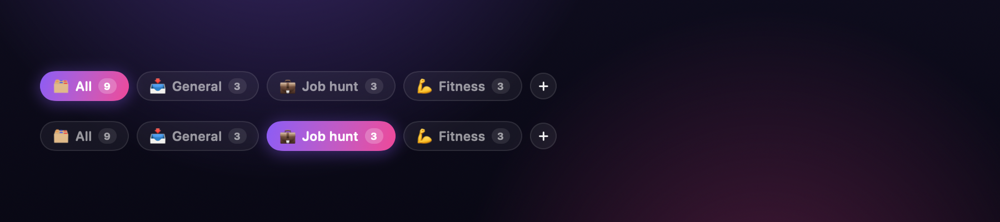
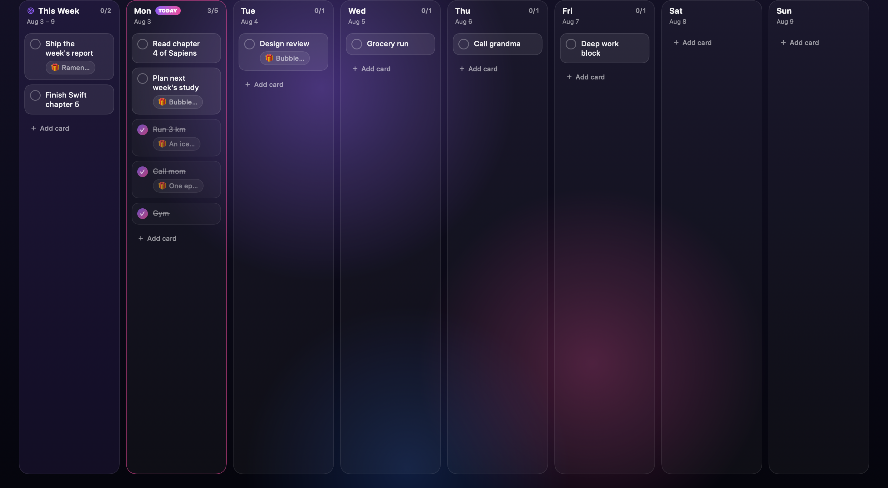
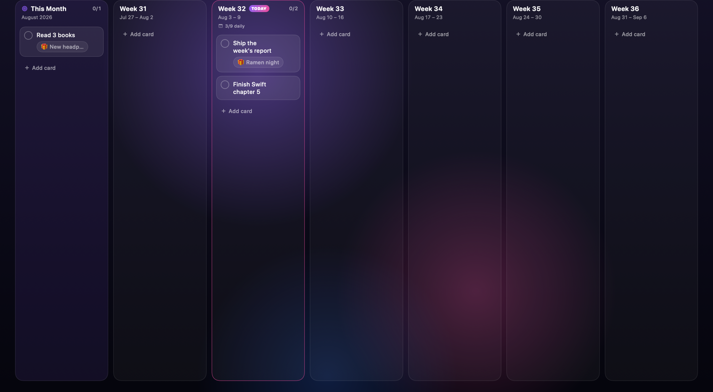
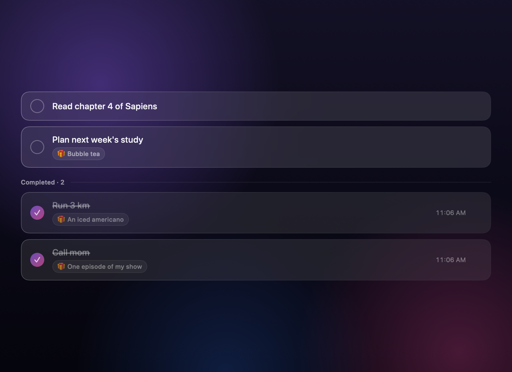
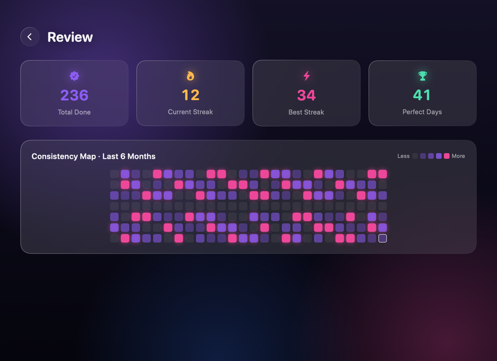
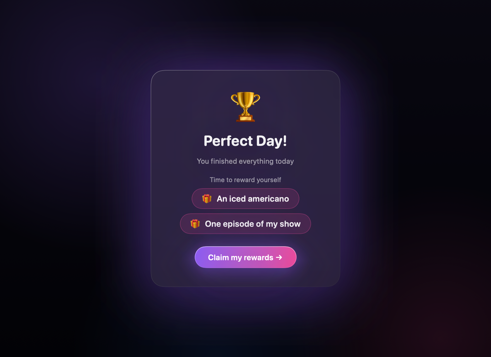

# iCanDoIt

A daily planner for macOS — write down what you want to get done today, attach a little reward to each task, and celebrate when you finish everything.

## Features

- **Morning ritual** — every day starts with one question: *What do you want to get done today?*
- **Boards per life track** — keep *Job hunt*, *LeetCode*, *Fitness* and whatever else on separate boards, each with its own emoji and open-task count. **All** shows everything at once.
- **Three zoom levels** — switch between **Today / Week / Month**. The week view is 7 day columns plus a *This Week* goals list; the month view is week columns (with a daily rollup) plus *This Month* goals. Page back and forth to plan ahead.
- **Drag & drop** — drag a card to another day to reschedule, drop it between cards to reorder, promote it into the week/month goals list, or drop it on a board chip to move it to another board
- **Reward yourself** — attach an optional reward to each task ("an iced americano", "one episode of my show"…)
- **Perfect Day** — finish everything and get a confetti celebration listing all the rewards you've earned
- **Streaks & stats** — current/best streak, total done, perfect days
- **Consistency map** — a GitHub-style heatmap of your last 6 months, with instant custom hover tooltips
- **Window appearance** — behind-window frosted glass via `NSVisualEffectView`, an animated aurora background, trackpad haptics
- **Local-first** — data lives in a local SwiftData (SQLite) store; no network, no accounts

## Screenshots

**Boards** — one per life track, with open-task counts. Drag a card onto a chip to move it.



**Week board** — 7 day columns plus a *This Week* goals list. Drag cards anywhere.



**Month board** — week columns with a daily rollup, plus *This Month* goals.



| Today | Review |
|---|---|
|  |  |



## Build & install

Requires Xcode (tested with Xcode 26 / Swift 6.3, macOS 15+).

```bash
./build.sh                      # builds and packages build/iCanDoIt.app
cp -R build/iCanDoIt.app /Applications/
```

No Xcode project needed — it's a plain Swift Package (SwiftUI + SwiftData) with a small packaging script.

### Dev self-check modes

Two hidden flags. The first renders every screen to PNGs off-screen (verifying visuals without screen-recording permissions):

```bash
.build/debug/iCanDoIt --snapshot /tmp/snaps
```

The second asserts the logic that a screenshot can't prove — drag-and-drop placement, schema backfill, stats:

```bash
.build/debug/iCanDoIt --selftest
```

## Tech notes

- **SwiftUI + SwiftData** — a plain Swift package, no `.xcodeproj`
- Frosted glass via `NSVisualEffectView` (`.fullScreenUI`, behind-window) with a thin tint so the desktop shows through
- Confetti is a pure-SwiftUI `Canvas` particle system
- The heatmap flattens its 182 shadowed cells into one GPU texture (`drawingGroup`) so screen transitions don't drop frames
- Icon is generated programmatically by `scripts/make_icon.swift`

---

Built with [Claude Code](https://claude.com/claude-code) 🤖
